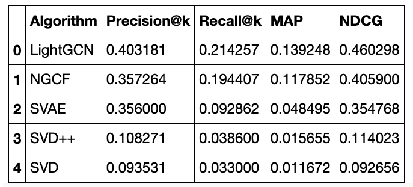
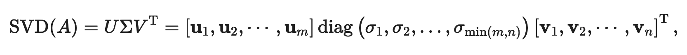
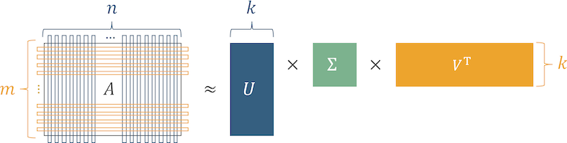
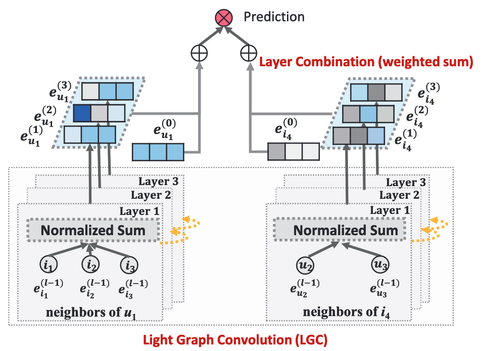

Better Than Netflix Movie Recommender
==============================

# Synopsis

Movie recommendation is core to Netflix, where their goal is to keep users
engaged and on their service for longer. More than 10 years after The Netflix
Prize competition, we explore advances in recommendation systems comparing
their performance to the winning algorithm from 2009. Taking advantage of
graphs, we implement from scratch a state-of-the-art recommender, Light Graph
Convolution Network (LightGCN), that vastly outperforms many traditional as well
as newer recommenders.

# Outcome
LightGCN vastly outperforms all other models. When compared to SVD++, LightGCN
achieves an increase in **Percision@k by 29%, Recall@k by 18%, MAP by 12%, and
NDCG by 35%**, demonstrating how far recommendation systems have advanced
since 2009.

\
(ranking metrics: the higher the better)

Project Organization
------------

    ├── README.md          <- The top-level README for developers using this project.
    │
    ├── models             <- Trained and serialized models, model predictions, or model summaries
    │
    ├── notebooks          <- Jupyter notebooks ordered by number. Contains the EDA,
    │                         implementation of the models, and comparsion of all the models
    │
    ├── reports            <- Generated analysis as HTML, PDF, LaTeX, etc.
    │   └── figures        <- Generated graphics and figures to be used in reporting
    │
    ├── requirements.txt   <- The requirements file for reproducing the analysis environment, e.g.
    │                         generated with `pip freeze > requirements.txt`
    │
    ├── setup.py           <- makes project pip installable (pip install -e .) so src can be imported
    ├── src                <- Source code for use in this project.
    │   ├── __init__.py    <- Makes src a Python module
    │   │
    │   ├── data           <- Scripts to download or generate data
    │   │
    │   ├── features       <- Scripts to turn raw data into features for modeling
    │   │
    │   └── models         <- Implementation of models
    │
    └── tox.ini            <- tox file with settings for running tox; see tox.readthedocs.io

--------

<small>Project structure based on the <a target="_blank" href="https://drivendata.github.io/cookiecutter-data-science/">cookiecutter data science project template</a>. #cookiecutterdatascience</small>

# Recommendation Today

Recommendation systems are one of the most powerful forces in our world today. 
They influence and direct our everyday decisions and thoughts. From what we buy
to what ad gets shown to our faces, recommendation systems are the backbone of
many billion-dollar companies. 

As such, much effort has been put into advance recommender systems. What we
will examine are these state-of-the-art systems, specifically Light Graph
Convolution Network (LightGCN). We will implement from scratch and then compare
this state-of-the-art recommender with other recent recommenders as well as
compare them to the winning algorithm from 2009's Netflix Prize. 

Using the MovieLens 100k dataset to train and compare our models, we will show
how far recommendation systems have come in 10+ years as well as demonstrate
the superior performance gained through the utilization of graph structure.

# The Netflix Prize

Seeing the importance of recommendation, Netflix hosted a $1,000,000 open
competition to find the best collaborative filtering algorithm. In 2009, the
prize was claimed by BellKor's Pragmatic Chaos team with an improvement of 
10.06% from Netflix's own algorithm.

The top and winning entries in the competition heavily utilized Singular Value
Decomposition (SVD) and SVD++.

<small>U is a matrix of (user  latent factors), S is a diagonal matrix, and
V is a matrix of (item * latent factors). Images: <a>https://takuti.github.io/Recommendation.jl/latest/collaborative_filtering/ </a> </small>

SVD is essentially a dimensionality reduction technique that decomposes a user-item matrix that is
approximately represented using three matrices. The user-item matrix is naturally
sparse because not every user has watched every movie. These values are filled
in by multiplying the three factorized matrices, allowing recommendations to be
made based on the predicted ratings for movies a user hasn't watched.

SVD also utilizes the items and users biases and SVD++ additionally includes
implicit information.

Though the winning entry uses a combination of SVD and SVD++ blended with
Restricted Boltzmann Machines, we will be utilizing Surprise's implementation
of SVD++ in our comparison.

# LightGCN

Before we can talk about LightGCN we must first talk about Neural Graph
Collaborative Filtering (NGCF) — a state-of-the-art GCN-based recommender model
from 2019. NGCF takes advantage of graph structure to generate embeddings of
both users and items. In our case, the items are the movies reviewed. These
embeddings can then be combined to generate recommendations for each user.

The graph used as input into NGCF is from the connections between users and
all the movies, where the users and movies are the nodes while each review
is a vertex connecting the user to the movie. This generates an undirected
graph (meaning the connections between nodes do not have a specified direction)
that allows messages to be passed from node to node.

<small>Image: <a>https://arxiv.org/abs/2002.02126 </a> </small>

The LightGCN is adapted from NGCF.  As you can expect from its name, LightGCN
is a simplified version of a typical GCN, where feature transformation and
nonlinear activation are dropped in favor of keeping only the essential 
component - neighborhood aggregation.

This simplification generates significant performance increases that can be
seen in typical ranking metrics such as mean average precision (MAP) and
normalized discounted cumulative gain (NDCG).

Since there LightGCN is so new, there are few to no implementations of LightGCN
which is why the main focus will be its custom implementation in Tensorflow as
well as a custom training loop used to train the GCN.

# Other Models

Other than NGCF from 2019, we also look at another fairly recent model
architecture, the Standard Variational Autoencoder (SVAE), which was developed
in 2018. SVAE uses an autoencoder to generate a salient feature representation
of users, learning a latent vector for each user. The decoder then takes this
latent representation and outputs a probability distribution over all items;
we get probabilities of all the movies being watched by each user

We won't go more into depth about SVAE since the main purpose is to compare SVD with
LightGCN. The reason SVAE is added is to demonstrate how LightGCN can
outperform other recently developed recommenders.

The implementation used for SVAE is from [Microsoft](https://github.com/microsoft/recommenders/blob/main/examples/02_model_collaborative_filtering/standard_vae_deep_dive.ipynb).

# Conclusion

Through ranking metrics, we have determined that LightGCN performs better than
all other models looked at in terms of recommendation based on the MovieLens
100k dataset. Though LightGCN is simpler and less computationally expensive
than NGCF, LightGCN has a notable improvement over NGCF as well as the other
recently developed system, SVAE. Compared to the traditional SVD++, LightGCN
achieves an increase in **Percision@k by 29%, Recall@k by 18%, MAP by 12%, and
NDCG by 35%**.

\
(ranking metrics: the higher the better)

In conclusion, this demonstrates how far recommendation systems have advanced
since 2009, and the dramatic increase in performance graph convolutional networks
can achieve over other traditional methods.

# References
1. https://netflixprize.com/community/topic_1537.html

2. https://takuti.github.io/Recommendation.jl/latest/collaborative_filtering/

3. Xiang Wang, Xiangnan He, Meng Wang, Fuli Feng, & Tata-Seng Chua, Neural Graph Collaorative Filtering, 2019, https://arxiv.org/abs/1905.08108

4. Xiangnan He, Kuan Deng, Xiang Wang, Yan Li, Yongdong Zhang & Meng Wang, LightGCN: Simplifying and Powering Graph Convolution Network for Recommendation, 2020, https://arxiv.org/abs/2002.02126

5. Kilol Gupta, Mukunds Y. Raghuprasad, Pankhuri Kumar, A Hybrid Variational Autoencoder for Collaborative Filtering, 2018, https://arxiv.org/pdf/1808.01006.pdf

